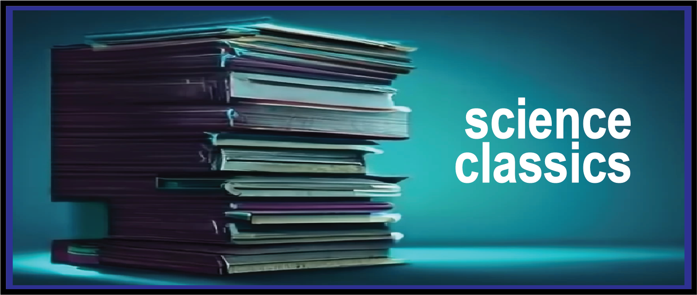

# A collection of classic scientific papers covering biology, engineering and physics.

I read a lot of scientific papers, recent and older, primarly in biology though my interests span engineering, computer science and physics. When it comes to keeping up with the current publications, I enjoy reading the older ones, learning about the years of incredible science that led to this very moment. Which papers contributed to the development of new fields? To new modes of thinking? To paradigm shifts? 

To those who I find influential, inspirational and visionary, this repository is an attempt at archiving your research. 

--

- Lazebnik, Yuri. (2002). Can a biologist fix a radio?--Or, what I learned while studying apoptosis. _Cancer cell_, 2(3), 179--182.
- P. W. Anderson (1972). More Is Different. _Science_, 177(4047), 393-396.
- Prewitt, Judith M. S. and Mendelsohn, Mortimer L. (1966). THE ANALYSIS OF CELL IMAGES. _Annals of the New York Academy of Sciences_, 128(3), 1035-1053.
- Schmit, Jeremy and Dill, Ken A. (2023). Next-Gen Biophysics: Look to the Forest, Beyond the Trees. _Annual Review of Biophysics_, 52(1), v-viii.
