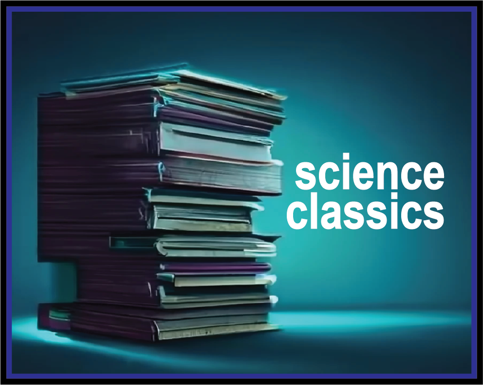

A collection of classic scientific papers covering biology, engineering, computer science, physics and, especially, their intersections.

I read a lot of papers about new and old sciences, spanning biology, engineering, computer science and physics. When it comes to keeping up with the current publications, I enjoy reading the old ones, reading about the years of incredible science that lead to this very moment. Which papers contributed to the development of an entire field? To new ways of thinking? To paradigm shift? 

To those who I find influential, inspirational and visionary, this repository is an attempt at archiving your research. 

--

- Lazebnik, Yuri (2002). Can a biologist fix a radio?--Or, what I learned while studying apoptosis. Cancer cell, 2(3), 179--182.
